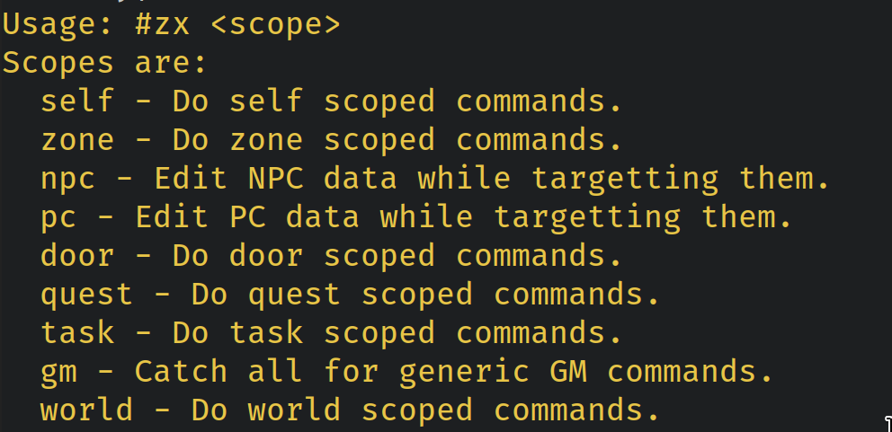
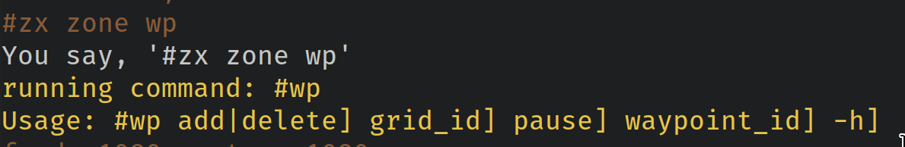
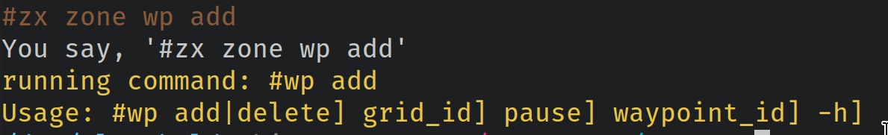

`#zx` commands for eqemu

**NOTE: At this time, #zx is still early preview and is incomplete!**
If you use this, feel free to let me know!We can see how we can improve it.

## What is this?

#zx is a set of lua alias commands to use on EQEmu servers.

If you've used eqemu recently, you may find the 450 commands that dump out on #help is a bit difficult to use.

Or, if you #help filter the results, there are some commands missing descriptions.

**#zx is set to resolve these headaches**

- Each command is "scoped", meaning based on your current situation, you can use it to help guide you on the proper command for what you're looking for, or perhaps learn what commands are available you may not be aware of.
- Once you execute a command, it will echo out the **real** command. You can choose to memorize the proper command in the future, or continue using the #zx variant one, whichever is more comfortable for you.

## How do I use it?

- Clone this repository to your lua_modules/commands/ subfolder, so once cloned it'll be lua_modules/commands/zx/
- Go into your lua_modules folder and edit commands.lua, adding a link to the commands like so:
```lua
commands["zx"] = { 50, require(commands_path .. "zx") };
```
- Note the `50` value. This means nobody under 50 status will see these commands.
- In game, type `#reload quest`
- In game, type `#zx`
- If everything is fine, you should see a #zx menu list.


## What does it look like?



Once you run a command, it tells you the 'true' command:


But of course, you can use the #zx prefixed version as well, arguments are passed to the real command:
